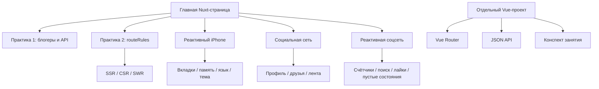

<div align="center">

# 🚀 Sait Proect
### Единый учебный проект: Nuxt-практики, реактивный iPhone и социальная сеть

Современный набор учебных страниц для демонстрации Nuxt, Vue Router, API-запросов, `routeRules`, реактивности, composables и utils.

---

[](http://localhost:3000)
[](https://github.com/DIBERLOG/sait-proect)
[](https://github.com/DIBERLOG/sait-proect/blob/main/LICENSE.md)
[](https://github.com/DIBERLOG)

---

🛡️ **Лицензия проекта:**  
Проект распространяется по персональной учебной лицензии **Sait Proect Personal License v1.0**.  
Использование и копирование материалов разрешено **только с письменного разрешения автора**.  
Подробнее — см. [LICENSE.md](https://github.com/DIBERLOG/sait-proect/blob/main/LICENSE.md)
</div>

---

## 🚀 Основные возможности

✅ **Единая главная страница Nuxt**  
На `/` собраны ссылки на все практики: блогеры, routeRules, iPhone, соцсеть, CSR, SWR и редирект.

✅ **Практика 1: блогеры и API**  
Страница `/practice-1` показывает работу с данными, карточками, MockAPI, формами и выводом списков.

✅ **Практика 2: routeRules**  
Страница `/practice-2` объясняет `prerender`, `swr`, `ssr: false`, redirect и кеширование рекомендаций.

✅ **Реактивный сайт iPhone**  
Маршруты `/catalog/iphone/16` и `/catalog/iphone-reactive/16` показывают вкладки Overview / Tech Specs / Pricing / Software, выбор памяти, языка и темы.

✅ **Социальная сеть как отдельная практика**  
Маршрут `/social-network` содержит профиль Егора Ангелова, друзей, ленту и форму создания поста.

✅ **Реактивная соцсеть для демонстрации учителю**  
Маршрут `/social-network-reactive` добавляет счётчики, поиск друзей через `computed`, лайки, пустые состояния и реактивное изменение интерфейса.

✅ **Отдельный Vue-проект социальной сети**  
Папка `social-network-template` содержит Vue Router, страницы `/`, `/friends`, `/user/:username`, `/feed`, API на JSON-файлах и конспект занятия.

✅ **Документация по занятиям**  
В папках `docs/` есть конспекты и шпаргалки по тестам и социальной сети.

---

## 🧱 Технологический стек

<p align="center">

| Раздел | Технологии |
|--------|-------------|
| 🖥️ Frontend | Nuxt 3, Vue 3, Vue Router |
| 🎨 UI/UX | Nuxt UI, Tailwind CSS, адаптивная вёрстка |
| ⚙️ Реактивность | ref, computed, useState, composables |
| 🌐 Данные | MockAPI, JSON API, useFetch / useAsyncData |
| 🧭 Маршрутизация | Nuxt Pages, Vue Router, dynamic routes |
| 🚦 Рендеринг | SSR, CSR, SWR, prerender, redirect через routeRules |
| 📚 Документация | README, Markdown-конспекты, Mermaid-диаграмма |

</p>

---

## 📌 Основные маршруты Nuxt

| Маршрут | Что показывает |
|--------|----------------|
| `/` | Главная страница со ссылками на все работы |
| `/practice-1` | Блогеры, API, вывод данных и форма |
| `/practice-2` | `routeRules`, SSR / CSR / SWR |
| `/catalog/iphone/16` | Реактивная страница iPhone |
| `/catalog/iphone-reactive/16` | Расширенная реактивность iPhone |
| `/social-network` | Базовая социальная сеть |
| `/social-network-reactive` | Счётчики, поиск, лайки и пустые состояния |
| `/admin` | CSR-админка |
| `/user_page` | SWR-страница пользователя |
| `/recommendations` | SWR-кеш на 3600 секунд |
| `/login` | Редирект на `/enter` |

---

## ▶️ Как запустить

### Nuxt-проект

```bash
cd nuxt_unified_practices
npm install
npm run dev
```

Открыть в браузере:

```txt
http://localhost:3000
```

### Отдельный Vue-проект социальной сети

```bash
cd social-network-template
npm install
npm run start
```

Во втором терминале:

```bash
npm run dev
```

Клиент:

```txt
http://localhost:5173
```

API:

```txt
http://localhost:3005
```

---

## 📊 Диаграмма структуры проекта




---

<div align="center">

🛡️ **Лицензия проекта:**  
Этот проект распространяется по специальной лицензии **Sait Proect Personal License v1.0**.  
Копирование, распространение и использование материалов разрешено **только с разрешения автора**.  
Подробнее см. [LICENSE.md](https://github.com/DIBERLOG/sait-proect/blob/main/LICENSE.md)

</div>

---

<div align="center">

✨ *Учебный проект становится сильнее, когда каждую функцию можно показать вживую.* ✨

</div>
